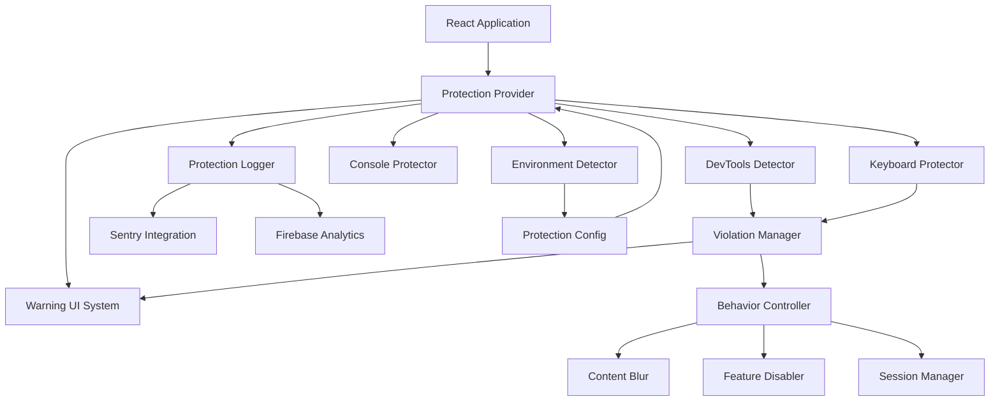

# Design Document: Code Protection Mechanism

## Overview

The Code Protection Mechanism is a comprehensive security layer designed to protect the React application's source code and sensitive data from unauthorized inspection in production environments. The system implements multiple defense layers including DevTools detection, console protection, keyboard shortcut blocking, and code obfuscation.

The design follows a modular architecture that integrates seamlessly with existing security infrastructure (AdminSecurityGate, Sentry, Firebase) while maintaining zero impact on development workflows. All protection mechanisms are environment-aware and activate only in production builds.

## Architecture

### High-Level Architecture



### Component Hierarchy


```
App.js
└── ProtectionProvider (Context Provider)
    ├── Environment Detection
    ├── DevTools Detection Service
    ├── Console Protection Service
    ├── Keyboard Protection Service
    ├── Violation Manager
    └── Warning Modal (Ant Design)
```

### Data Flow

1. **Initialization Flow**:
   - App loads → ProtectionProvider initializes
   - Check NODE_ENV → Load configuration
   - If production → Activate all protection services
   - If development → Remain inactive, log status

2. **Detection Flow**:
   - DevTools Detector runs continuous checks (500ms interval)
   - Keyboard events captured by event listeners
   - Violations detected → ViolationManager notified
   - ViolationManager updates state → Triggers UI and behavior changes

3. **Response Flow**:
   - Violation detected → Warning UI displays immediately
   - Violation counter increments in session storage
   - If threshold exceeded → Behavior Controller activates restrictions
   - All events logged to Sentry and Firebase

## Components and Interfaces

### 1. ProtectionProvider Component

**Purpose**: Root context provider that orchestrates all protection mechanisms.

**Props**:
```typescript
interface ProtectionProviderProps {
  children: React.ReactNode;
  config?: ProtectionConfig;
  onViolation?: (violation: ViolationEvent) => void;
}

interface ProtectionConfig {
  enabled: boolean;
  devToolsDetection: boolean;
  consoleProtection: boolean;
  keyboardProtection: boolean;
  warningLevel: 'info' | 'warning' | 'critical';
  violationThreshold: number;
  customMessages?: {
    warningTitle?: string;
    warningContent?: string;
  };
  whitelist?: {
    ipAddresses?: string[];
    userRoles?: string[];
  };
}
```

**State**:
```typescript
interface ProtectionState {
  isActive: boolean;
  isDevToolsOpen: boolean;
  violationCount: number;
  showWarning: boolean;
  restrictedMode: boolean;
}
```

**Implementation**:
```javascript
// src/contexts/ProtectionContext.jsx
import React, { createContext, useContext, useState, useEffect } from 'react';
import { useDevToolsDetection } from '../hooks/useDevToolsDetection';
import { useConsoleProtection } from '../hooks/useConsoleProtection';
import { useKeyboardProtection } from '../hooks/useKeyboardProtection';
import ProtectionWarningModal from '../components/ProtectionWarningModal';

const ProtectionContext = createContext(null);

export const ProtectionProvider = ({ children, config = {}, onViolation }) => {
  const isProduction = process.env.NODE_ENV === 'production';
  const isEnabled = config.enabled !== false && isProduction;
  
  const [state, setState] = useState({
    isActive: isEnabled,
    isDevToolsOpen: false,
    violationCount: 0,
    showWarning: false,
    restrictedMode: false
  });

  // Initialize protection hooks
  const devToolsDetection = useDevToolsDetection(isEnabled);
  const consoleProtection = useConsoleProtection(isEnabled);
  const keyboardProtection = useKeyboardProtection(isEnabled);

  // Handle violations
  useEffect(() => {
    if (devToolsDetection.isOpen) {
      handleViolation('devtools_opened');
    }
  }, [devToolsDetection.isOpen]);

  const handleViolation = (type) => {
    const newCount = state.violationCount + 1;
    
    setState(prev => ({
      ...prev,
      violationCount: newCount,
      showWarning: true,
      restrictedMode: newCount >= (config.violationThreshold || 3)
    }));

    // Log violation
    logViolation(type, newCount);
    
    // Callback
    if (onViolation) {
      onViolation({ type, count: newCount, timestamp: Date.now() });
    }
  };

  const value = {
    ...state,
    config,
    handleViolation
  };

  return (
    <ProtectionContext.Provider value={value}>
      {children}
      {state.showWarning && (
        <ProtectionWarningModal
          visible={state.showWarning}
          onClose={() => setState(prev => ({ ...prev, showWarning: false }))}
          config={config}
        />
      )}
    </ProtectionContext.Provider>
  );
};

export const useProtection = () => {
  const context = useContext(ProtectionContext);
  if (!context) {
    throw new Error('useProtection must be used within ProtectionProvider');
  }
  return context;
};
```

### 2. DevTools Detection Service

**Purpose**: Detect when browser DevTools is opened using multiple detection techniques.

**Detection Techniques**:
1. **Console.log timing**: Measure time difference when console is open
2. **Window size detection**: Detect when window is resized due to DevTools
3. **Debugger statement**: Detect when debugger is active
4. **toString override**: Detect when console methods are inspected

**Hook Implementation**:
```javascript
// src/hooks/useDevToolsDetection.js
import { useState, useEffect, useRef } from 'react';

export const useDevToolsDetection = (enabled = true) => {
  const [isOpen, setIsOpen] = useState(false);
  const intervalRef = useRef(null);
  const thresholdRef = useRef(160);

  useEffect(() => {
    if (!enabled) return;

    const detectDevTools = () => {
      // Technique 1: Console timing
      const start = performance.now();
      console.log('%c', 'color: transparent');
      const end = performance.now();
      const timeDiff = end - start;

      // Technique 2: Window size
      const widthThreshold = window.outerWidth - window.innerWidth > thresholdRef.current;
      const heightThreshold = window.outerHeight - window.innerHeight > thresholdRef.current;

      // Technique 3: DevTools detection object
      const devtoolsDetector = /./;
      devtoolsDetector.toString = function() {
        setIsOpen(true);
        return 'devtools';
      };

      // Combine techniques
      const detected = timeDiff > 100 || widthThreshold || heightThreshold;
      
      if (detected !== isOpen) {
        setIsOpen(detected);
      }
    };

    // Run detection every 500ms
    intervalRef.current = setInterval(detectDevTools, 500);

    // Cleanup
    return () => {
      if (intervalRef.current) {
        clearInterval(intervalRef.current);
      }
    };
  }, [enabled, isOpen]);

  return { isOpen, enabled };
};
```

### 3. Console Protection Service

**Purpose**: Disable console methods in production to prevent information leakage.

**Hook Implementation**:
```javascript
// src/hooks/useConsoleProtection.js
import { useEffect, useRef } from 'react';
import { reportError } from '../utils/sentry';

export const useConsoleProtection = (enabled = true) => {
  const originalConsole = useRef({});

  useEffect(() => {
    if (!enabled) return;

    // Store original console methods
    originalConsole.current = {
      log: console.log,
      warn: console.warn,
      error: console.error,
      info: console.info,
      debug: console.debug,
      table: console.table,
      trace: console.trace
    };

    // Override console methods
    const noop = () => {};
    
    console.log = noop;
    console.warn = noop;
    console.info = noop;
    console.debug = noop;
    console.table = noop;
    console.trace = noop;

    // Keep console.error for error boundaries, but redirect to Sentry
    console.error = (...args) => {
      reportError(new Error(args.join(' ')), { source: 'console.error' });
    };

    // Cleanup: restore original console
    return () => {
      Object.keys(originalConsole.current).forEach(method => {
        console[method] = originalConsole.current[method];
      });
    };
  }, [enabled]);

  return { enabled };
};
```

### 4. Keyboard Protection Service

**Purpose**: Block keyboard shortcuts commonly used to open DevTools.

**Hook Implementation**:
```javascript
// src/hooks/useKeyboardProtection.js
import { useEffect } from 'react';

export const useKeyboardProtection = (enabled = true) => {
  useEffect(() => {
    if (!enabled) return;

    const handleKeyDown = (e) => {
      // F12
      if (e.keyCode === 123) {
        e.preventDefault();
        return false;
      }

      // Ctrl+Shift+I (Windows/Linux) or Cmd+Option+I (Mac)
      if ((e.ctrlKey || e.metaKey) && e.shiftKey && e.keyCode === 73) {
        e.preventDefault();
        return false;
      }

      // Ctrl+Shift+J (Console)
      if ((e.ctrlKey || e.metaKey) && e.shiftKey && e.keyCode === 74) {
        e.preventDefault();
        return false;
      }

      // Ctrl+Shift+C (Inspect Element)
      if ((e.ctrlKey || e.metaKey) && e.shiftKey && e.keyCode === 67) {
        e.preventDefault();
        return false;
      }

      // Ctrl+U (View Source)
      if ((e.ctrlKey || e.metaKey) && e.keyCode === 85) {
        e.preventDefault();
        return false;
      }
    };

    const handleContextMenu = (e) => {
      e.preventDefault();
      return false;
    };

    // Add event listeners
    document.addEventListener('keydown', handleKeyDown);
    document.addEventListener('contextmenu', handleContextMenu);

    // Cleanup
    return () => {
      document.removeEventListener('keydown', handleKeyDown);
      document.removeEventListener('contextmenu', handleContextMenu);
    };
  }, [enabled]);

  return { enabled };
};
```

### 5. Warning UI Component

**Purpose**: Display warning modal when violations are detected.

**Component Implementation**:
```javascript
// src/components/ProtectionWarningModal.jsx
import React from 'react';
import { Modal, Typography, Space } from 'antd';
import { ShieldAlert } from 'lucide-react';
import { motion } from 'framer-motion';

const { Title, Text } = Typography;

const ProtectionWarningModal = ({ visible, onClose, config }) => {
  const messages = config.customMessages || {};
  
  const defaultTitle = 'Cảnh báo bảo mật';
  const defaultContent = 'Hệ thống đã phát hiện hành vi cố gắng truy cập mã nguồn. Vui lòng đóng Developer Tools để tiếp tục sử dụng ứng dụng.';

  return (
    <Modal
      open={visible}
      onCancel={onClose}
      footer={null}
      closable={false}
      centered
      width={500}
      maskStyle={{ backdropFilter: 'blur(8px)' }}
      bodyStyle={{ padding: '40px' }}
    >
      <motion.div
        initial={{ scale: 0.9, opacity: 0 }}
        animate={{ scale: 1, opacity: 1 }}
        transition={{ duration: 0.3 }}
      >
        <Space direction="vertical" size="large" style={{ width: '100%', textAlign: 'center' }}>
          <motion.div
            animate={{ 
              scale: [1, 1.1, 1],
              rotate: [0, 5, -5, 0]
            }}
            transition={{ 
              duration: 0.5,
              repeat: Infinity,
              repeatDelay: 2
            }}
          >
            <ShieldAlert size={64} color="#ff4d4f" />
          </motion.div>

          <Title level={3} style={{ margin: 0, color: '#ff4d4f' }}>
            {messages.warningTitle || defaultTitle}
          </Title>

          <Text style={{ fontSize: '16px', color: '#595959' }}>
            {messages.warningContent || defaultContent}
          </Text>

          <Text type="secondary" style={{ fontSize: '12px' }}>
            © 2026 NôngLạc - Hệ thống bảo vệ mã nguồn
          </Text>
        </Space>
      </motion.div>
    </Modal>
  );
};

export default ProtectionWarningModal;
```

### 6. Violation Manager

**Purpose**: Track and manage security violations, enforce thresholds.

**Implementation**:
```javascript
// src/services/violationManager.js
import { reportError, addBreadcrumb } from '../utils/sentry';

class ViolationManager {
  constructor() {
    this.violations = [];
    this.sessionKey = 'protection_violations';
    this.loadViolations();
  }

  loadViolations() {
    try {
      const stored = sessionStorage.getItem(this.sessionKey);
      this.violations = stored ? JSON.parse(stored) : [];
    } catch (error) {
      this.violations = [];
    }
  }

  saveViolations() {
    try {
      sessionStorage.setItem(this.sessionKey, JSON.stringify(this.violations));
    } catch (error) {
      reportError(error, { context: 'violationManager.saveViolations' });
    }
  }

  addViolation(type, metadata = {}) {
    const violation = {
      type,
      timestamp: Date.now(),
      userAgent: navigator.userAgent,
      url: window.location.href,
      ...metadata
    };

    this.violations.push(violation);
    this.saveViolations();

    // Log to Sentry
    addBreadcrumb(
      `Security violation: ${type}`,
      'security',
      'warning'
    );

    // Report if threshold exceeded
    if (this.violations.length >= 3) {
      reportError(new Error(`Multiple security violations: ${this.violations.length}`), {
        violations: this.violations,
        type: 'security'
      });
    }

    return violation;
  }

  getViolationCount() {
    return this.violations.length;
  }

  getViolations() {
    return [...this.violations];
  }

  clearViolations() {
    this.violations = [];
    sessionStorage.removeItem(this.sessionKey);
  }

  shouldRestrict(threshold = 3) {
    return this.violations.length >= threshold;
  }
}

export const violationManager = new ViolationManager();
export default violationManager;
```

### 7. Behavior Controller

**Purpose**: Control application behavior based on violation severity.

**Implementation**:
```javascript
// src/services/behaviorController.js
import { violationManager } from './violationManager';

class BehaviorController {
  constructor() {
    this.restrictedMode = false;
    this.blurredElements = [];
  }

  checkRestrictions() {
    const shouldRestrict = violationManager.shouldRestrict();
    
    if (shouldRestrict && !this.restrictedMode) {
      this.enableRestrictedMode();
    } else if (!shouldRestrict && this.restrictedMode) {
      this.disableRestrictedMode();
    }

    return this.restrictedMode;
  }

  enableRestrictedMode() {
    this.restrictedMode = true;
    this.blurSensitiveContent();
    this.disableSensitiveFeatures();
    
    // Dispatch event for components to react
    window.dispatchEvent(new CustomEvent('protection:restricted', {
      detail: { enabled: true }
    }));
  }

  disableRestrictedMode() {
    this.restrictedMode = false;
    this.unblurContent();
    this.enableFeatures();
    
    window.dispatchEvent(new CustomEvent('protection:restricted', {
      detail: { enabled: false }
    }));
  }

  blurSensitiveContent() {
    // Blur elements with data-sensitive attribute
    const sensitiveElements = document.querySelectorAll('[data-sensitive="true"]');
    
    sensitiveElements.forEach(el => {
      el.style.filter = 'blur(10px)';
      el.style.pointerEvents = 'none';
      this.blurredElements.push(el);
    });
  }

  unblurContent() {
    this.blurredElements.forEach(el => {
      el.style.filter = '';
      el.style.pointerEvents = '';
    });
    this.blurredElements = [];
  }

  disableSensitiveFeatures() {
    // Disable admin features
    const adminElements = document.querySelectorAll('[data-admin="true"]');
    adminElements.forEach(el => {
      el.style.display = 'none';
    });
  }

  enableFeatures() {
    const adminElements = document.querySelectorAll('[data-admin="true"]');
    adminElements.forEach(el => {
      el.style.display = '';
    });
  }

  forceLogout() {
    // Clear session
    sessionStorage.clear();
    localStorage.removeItem('auth_token');
    
    // Redirect to login
    window.location.href = '/login';
  }
}

export const behaviorController = new BehaviorController();
export default behaviorController;
```

### 8. Protection Logger

**Purpose**: Centralized logging for all protection events.

**Implementation**:
```javascript
// src/services/protectionLogger.js
import { reportError, addBreadcrumb } from '../utils/sentry';
import { getFirestore, collection, addDoc } from 'firebase/firestore';

class ProtectionLogger {
  constructor() {
    this.db = null;
  }

  initialize(firebaseApp) {
    this.db = getFirestore(firebaseApp);
  }

  async logViolation(type, metadata = {}) {
    const logEntry = {
      type,
      timestamp: Date.now(),
      userAgent: navigator.userAgent,
      url: window.location.href,
      screenResolution: `${window.screen.width}x${window.screen.height}`,
      ...metadata
    };

    // Log to Sentry
    addBreadcrumb(
      `Protection violation: ${type}`,
      'security',
      'warning'
    );

    // Log to Firebase
    if (this.db) {
      try {
        await addDoc(collection(this.db, 'security_violations'), logEntry);
      } catch (error) {
        reportError(error, { context: 'protectionLogger.logViolation' });
      }
    }

    // Log to console in development
    if (process.env.NODE_ENV === 'development') {
      console.warn('[Protection]', type, logEntry);
    }

    return logEntry;
  }

  async logEvent(eventType, data = {}) {
    const logEntry = {
      eventType,
      timestamp: Date.now(),
      ...data
    };

    addBreadcrumb(
      `Protection event: ${eventType}`,
      'security',
      'info'
    );

    if (this.db) {
      try {
        await addDoc(collection(this.db, 'security_events'), logEntry);
      } catch (error) {
        // Fail silently
      }
    }

    return logEntry;
  }
}

export const protectionLogger = new ProtectionLogger();
export default protectionLogger;
```

## Data Models

### ViolationEvent

```typescript
interface ViolationEvent {
  type: 'devtools_opened' | 'keyboard_blocked' | 'context_menu_blocked';
  timestamp: number;
  userAgent: string;
  url: string;
  metadata?: Record<string, any>;
}
```

### ProtectionState

```typescript
interface ProtectionState {
  isActive: boolean;
  isDevToolsOpen: boolean;
  violationCount: number;
  showWarning: boolean;
  restrictedMode: boolean;
  lastViolation?: ViolationEvent;
}
```

### ProtectionConfig

```typescript
interface ProtectionConfig {
  enabled: boolean;
  devToolsDetection: boolean;
  consoleProtection: boolean;
  keyboardProtection: boolean;
  warningLevel: 'info' | 'warning' | 'critical';
  violationThreshold: number;
  autoLogout: boolean;
  customMessages?: {
    warningTitle?: string;
    warningContent?: string;
  };
  whitelist?: {
    ipAddresses?: string[];
    userRoles?: string[];
  };
}
```

## Correctness Properties

*A property is a characteristic or behavior that should hold true across all valid executions of a system—essentially, a formal statement about what the system should do. Properties serve as the bridge between human-readable specifications and machine-verifiable correctness guarantees.*


### Property Reflection

After analyzing all acceptance criteria, I identified several areas where properties can be consolidated:

**Consolidation Opportunities:**
1. Properties 5.2, 5.3, 5.4 (keyboard shortcuts) can be combined into one comprehensive property about keyboard blocking
2. Properties 1.2 and 3.1 (detection triggers warning) are related and can be verified together
3. Properties 2.1, 2.2, 2.3 (console protection) can be consolidated into environment-aware console behavior
4. Properties 7.1, 7.2, 7.3 (environment detection) can be combined into one property about environment-based activation
5. Properties 4.2 and 4.3 (blur/restore) are inverse operations that can be tested as a round-trip property

**Redundancy Elimination:**
- Property 1.3 (logging) is a side effect that will be tested through integration, not as a separate property
- Property 3.5 (Ant Design usage) is an implementation detail, tested as an example
- Properties 6.1-6.4 (obfuscation) are build-time checks, tested as examples not properties

### Correctness Properties

Property 1: DevTools Detection Timing
*For any* production environment session, when DevTools is opened, the Detection_Service should detect it within 500ms and trigger the warning mechanism
**Validates: Requirements 1.1, 1.2**

Property 2: DevTools State Persistence
*For any* detection session, while DevTools remains open, the warning state should remain active and the system should continuously monitor
**Validates: Requirements 1.4**

Property 3: Environment-Based Activation
*For any* application initialization, if NODE_ENV is 'production' then all protection mechanisms should activate, otherwise they should remain inactive
**Validates: Requirements 1.5, 7.1, 7.2, 7.3**

Property 4: Console Protection in Production
*For any* console method call (log, warn, info, debug) in production environment, the call should be silently ignored without throwing errors
**Validates: Requirements 2.1, 2.2**

Property 5: Console Preservation in Development
*For any* console method call in development environment, the call should execute normally and produce output
**Validates: Requirements 2.3**

Property 6: Error Routing to Sentry
*For any* critical error in production, the error should be logged to Sentry instead of browser console
**Validates: Requirements 2.4**

Property 7: Console.error Preservation
*For any* console.error call, the call should remain functional for error boundary components regardless of environment
**Validates: Requirements 2.5**

Property 8: Warning UI Display Timing
*For any* DevTools detection event, the Warning_UI should display within 100ms with the configured warning message
**Validates: Requirements 3.1, 3.2**

Property 9: Warning UI Interaction Blocking
*For any* user interaction attempt while warning is active, the interaction should not reach underlying application content
**Validates: Requirements 3.3**

Property 10: Warning Auto-Dismiss
*For any* warning display, when DevTools is closed, the warning should automatically dismiss within 2 seconds
**Validates: Requirements 3.4**

Property 11: Warning UI Content Presence
*For any* warning modal display, the modal should contain a warning icon and Vietnamese message text
**Validates: Requirements 3.6**

Property 12: Time-Based Feature Restriction
*For any* session where DevTools remains open for more than 5 seconds, sensitive features should be disabled
**Validates: Requirements 4.1**

Property 13: Content Protection Round-Trip
*For any* sensitive content, when DevTools is detected the content should be blurred, and when DevTools is closed the content should be restored to normal
**Validates: Requirements 4.2, 4.3**

Property 14: Violation Threshold Enforcement
*For any* session, if DevTools is opened more than 3 times, the system should log out the user and clear session data
**Validates: Requirements 4.4**

Property 15: Violation Counter Persistence
*For any* violation event, the violation count should be incremented and persisted in session storage
**Validates: Requirements 4.5**

Property 16: Right-Click Prevention in Production
*For any* right-click event in production environment, the default context menu should be prevented from appearing
**Validates: Requirements 5.1**

Property 17: Keyboard Shortcut Blocking
*For any* DevTools keyboard shortcut (F12, Ctrl+Shift+I, Ctrl+Shift+J, Ctrl+Shift+C) in production, the default action should be prevented
**Validates: Requirements 5.2, 5.3, 5.4**

Property 18: Keyboard Freedom in Development
*For any* keyboard shortcut or right-click in development environment, the default browser behavior should work normally
**Validates: Requirements 5.5**

Property 19: Configuration Override
*For any* protection configuration with manual override flag, the system should respect the override regardless of NODE_ENV value
**Validates: Requirements 7.4**

Property 20: Development Mode Logging
*For any* application initialization in non-production environment, the system should log a message indicating development mode
**Validates: Requirements 7.5**

Property 21: Firebase Logging Integration
*For any* violation event, the event should be logged to Firebase using the existing logging infrastructure
**Validates: Requirements 8.2**

Property 22: Monitoring System Integration
*For any* protection event, the system should expose hooks and events that monitoring systems can subscribe to
**Validates: Requirements 8.4**

Property 23: Authentication Flow Compatibility
*For any* authentication or authorization flow, the protection system should not interfere with normal auth operations
**Validates: Requirements 8.5**

Property 24: Performance Impact Limit
*For any* page load with protection active, the load time should be within 5% of the load time without protection
**Validates: Requirements 9.1**

Property 25: Bundle Size Limit
*For any* production build with protection enabled, the protection system should add no more than 50KB to the bundle size
**Validates: Requirements 9.4**

Property 26: Configuration Toggles
*For any* protection feature (devTools, console, keyboard), the feature should be independently toggleable via configuration
**Validates: Requirements 10.1**

Property 27: Warning Severity Configuration
*For any* configured warning severity level (info, warning, critical), the warning UI should reflect the appropriate severity styling
**Validates: Requirements 10.2**

Property 28: Custom Message Display
*For any* custom warning message configured, the warning UI should display the custom message instead of default text
**Validates: Requirements 10.3**

Property 29: Whitelist Bypass
*For any* user on the whitelist (by IP or role), all protection mechanisms should be bypassed
**Validates: Requirements 10.4**

Property 30: Dynamic Configuration Application
*For any* configuration change, the new settings should apply immediately without requiring application restart
**Validates: Requirements 10.5**

## Error Handling

### Error Categories

1. **Detection Errors**
   - DevTools detection fails or throws exception
   - Fallback: Log error to Sentry, continue with other protections
   - User impact: None (silent failure)

2. **Console Override Errors**
   - Console methods cannot be overridden (browser restriction)
   - Fallback: Log warning, continue with other protections
   - User impact: Console may still work

3. **Event Listener Errors**
   - Keyboard/mouse event listeners fail to attach
   - Fallback: Log error, continue with other protections
   - User impact: Shortcuts may still work

4. **Storage Errors**
   - Session storage unavailable or quota exceeded
   - Fallback: Use in-memory storage, log warning
   - User impact: Violation count may reset on page reload

5. **Firebase Logging Errors**
   - Firebase unavailable or network error
   - Fallback: Log to Sentry only, continue operation
   - User impact: None (silent failure)

6. **UI Rendering Errors**
   - Warning modal fails to render
   - Fallback: Use browser alert() as last resort
   - User impact: Less polished warning UI

### Error Handling Strategy

```javascript
// src/utils/errorHandler.js
import { reportError } from './sentry';

export const handleProtectionError = (error, context) => {
  // Log to Sentry
  reportError(error, {
    component: 'code-protection',
    ...context
  });

  // Log to console in development
  if (process.env.NODE_ENV === 'development') {
    console.error('[Protection Error]', error, context);
  }

  // Don't throw - fail gracefully
  return null;
};

export const withErrorBoundary = (fn, fallback = null) => {
  try {
    return fn();
  } catch (error) {
    handleProtectionError(error, { function: fn.name });
    return fallback;
  }
};
```

### Graceful Degradation

The protection system follows a graceful degradation strategy:

1. **Full Protection** (All mechanisms active)
   - DevTools detection ✓
   - Console protection ✓
   - Keyboard blocking ✓
   - Warning UI ✓

2. **Partial Protection** (Some mechanisms fail)
   - Continue with working mechanisms
   - Log failures to monitoring
   - User experience mostly unaffected

3. **No Protection** (Critical failure)
   - Application continues to work normally
   - All protection disabled
   - Error logged for investigation

## Testing Strategy

### Dual Testing Approach

The testing strategy combines unit tests for specific scenarios and property-based tests for universal properties:

**Unit Tests**: Focus on specific examples, edge cases, and integration points
- Specific DevTools detection scenarios
- Console method override verification
- Event listener attachment
- UI component rendering
- Firebase integration
- Error boundary behavior

**Property-Based Tests**: Verify universal properties across all inputs
- Run minimum 100 iterations per property test
- Use random input generation for comprehensive coverage
- Each test references its design document property
- Tag format: **Feature: code-protection-mechanism, Property {number}: {property_text}**

### Testing Framework

**Unit Testing**:
- Framework: Jest + React Testing Library
- Coverage target: 80% for core protection logic
- Mock browser APIs (console, localStorage, etc.)

**Property-Based Testing**:
- Framework: fast-check (JavaScript property testing library)
- Configuration: 100+ iterations per property
- Generators for: environments, user actions, configurations

**Integration Testing**:
- Test protection system with real React components
- Verify integration with AdminSecurityGate
- Test Firebase logging integration
- Verify Sentry error reporting

**E2E Testing** (Optional):
- Framework: Playwright or Cypress
- Test actual DevTools detection in real browser
- Verify keyboard shortcuts are blocked
- Test warning UI display and interaction

### Test Organization

```
src/
├── __tests__/
│   ├── unit/
│   │   ├── devToolsDetection.test.js
│   │   ├── consoleProtection.test.js
│   │   ├── keyboardProtection.test.js
│   │   ├── violationManager.test.js
│   │   └── behaviorController.test.js
│   ├── property/
│   │   ├── environmentActivation.property.test.js
│   │   ├── consoleProtection.property.test.js
│   │   ├── keyboardBlocking.property.test.js
│   │   ├── violationThreshold.property.test.js
│   │   └── configuration.property.test.js
│   └── integration/
│       ├── protectionProvider.integration.test.js
│       ├── firebaseIntegration.integration.test.js
│       └── sentryIntegration.integration.test.js
```

### Property Test Example

```javascript
// src/__tests__/property/environmentActivation.property.test.js
import fc from 'fast-check';
import { ProtectionProvider } from '../../contexts/ProtectionContext';

/**
 * Feature: code-protection-mechanism
 * Property 3: Environment-Based Activation
 * 
 * For any application initialization, if NODE_ENV is 'production' 
 * then all protection mechanisms should activate, otherwise they 
 * should remain inactive
 */
describe('Property 3: Environment-Based Activation', () => {
  it('should activate in production and deactivate in non-production', () => {
    fc.assert(
      fc.property(
        fc.constantFrom('production', 'development', 'test'),
        (nodeEnv) => {
          // Set environment
          const originalEnv = process.env.NODE_ENV;
          process.env.NODE_ENV = nodeEnv;

          // Initialize protection
          const { result } = renderHook(() => useProtection(), {
            wrapper: ProtectionProvider
          });

          // Verify activation state
          const shouldBeActive = nodeEnv === 'production';
          expect(result.current.isActive).toBe(shouldBeActive);

          // Cleanup
          process.env.NODE_ENV = originalEnv;
        }
      ),
      { numRuns: 100 }
    );
  });
});
```

### Test Coverage Requirements

- **Core Protection Logic**: 90% coverage
- **UI Components**: 80% coverage
- **Integration Points**: 70% coverage
- **Error Handlers**: 85% coverage

### Continuous Testing

- Run unit tests on every commit
- Run property tests on pull requests
- Run integration tests before deployment
- Monitor test execution time (< 30 seconds for unit tests)

## Build Configuration

### Webpack/Vite Configuration for Obfuscation

**For Vite** (Recommended):

```javascript
// vite.config.js
import { defineConfig } from 'vite';
import react from '@vitejs/plugin-react';
import obfuscator from 'rollup-plugin-obfuscator';

export default defineConfig(({ mode }) => ({
  plugins: [
    react(),
    mode === 'production' && obfuscator({
      compact: true,
      controlFlowFlattening: true,
      controlFlowFlatteningThreshold: 0.75,
      deadCodeInjection: true,
      deadCodeInjectionThreshold: 0.4,
      debugProtection: false,
      debugProtectionInterval: 0,
      disableConsoleOutput: true,
      identifierNamesGenerator: 'hexadecimal',
      log: false,
      numbersToExpressions: true,
      renameGlobals: false,
      selfDefending: true,
      simplify: true,
      splitStrings: true,
      splitStringsChunkLength: 10,
      stringArray: true,
      stringArrayCallsTransform: true,
      stringArrayEncoding: ['base64'],
      stringArrayIndexShift: true,
      stringArrayRotate: true,
      stringArrayShuffle: true,
      stringArrayWrappersCount: 2,
      stringArrayWrappersChainedCalls: true,
      stringArrayWrappersParametersMaxCount: 4,
      stringArrayWrappersType: 'function',
      stringArrayThreshold: 0.75,
      transformObjectKeys: true,
      unicodeEscapeSequence: false
    })
  ].filter(Boolean),
  build: {
    sourcemap: mode === 'production' ? 'hidden' : true,
    minify: 'terser',
    terserOptions: {
      compress: {
        drop_console: true,
        drop_debugger: true
      }
    }
  }
}));
```

**For Webpack**:

```javascript
// webpack.config.js
const JavaScriptObfuscator = require('webpack-obfuscator');

module.exports = {
  // ... other config
  plugins: [
    process.env.NODE_ENV === 'production' && new JavaScriptObfuscator({
      rotateStringArray: true,
      stringArray: true,
      stringArrayThreshold: 0.75
    }, ['excluded_bundle_name.js'])
  ].filter(Boolean)
};
```

### Environment Variables

```bash
# .env.production
NODE_ENV=production
REACT_APP_PROTECTION_ENABLED=true
REACT_APP_VIOLATION_THRESHOLD=3
REACT_APP_WARNING_LEVEL=critical
REACT_APP_SENTRY_DSN=your_sentry_dsn
```

## Integration Guide

### Step 1: Wrap Application with ProtectionProvider

```javascript
// src/App.js
import React from 'react';
import { ProtectionProvider } from './contexts/ProtectionContext';
import { protectionLogger } from './services/protectionLogger';
import { firebaseApp } from './config/firebase';

// Initialize logger
protectionLogger.initialize(firebaseApp);

const protectionConfig = {
  enabled: true,
  devToolsDetection: true,
  consoleProtection: true,
  keyboardProtection: true,
  warningLevel: 'critical',
  violationThreshold: 3,
  customMessages: {
    warningTitle: 'Cảnh báo bảo mật',
    warningContent: 'Hệ thống đã phát hiện hành vi cố gắng truy cập mã nguồn.'
  }
};

function App() {
  return (
    <ProtectionProvider 
      config={protectionConfig}
      onViolation={(event) => {
        console.log('Violation detected:', event);
      }}
    >
      {/* Your app components */}
    </ProtectionProvider>
  );
}

export default App;
```

### Step 2: Mark Sensitive Content

```javascript
// Mark sensitive elements with data attribute
<div data-sensitive="true">
  {/* Sensitive user data */}
</div>

<div data-admin="true">
  {/* Admin-only features */}
</div>
```

### Step 3: Use Protection Hook in Components

```javascript
import { useProtection } from '../contexts/ProtectionContext';

function AdminPanel() {
  const { restrictedMode, violationCount } = useProtection();

  if (restrictedMode) {
    return <div>Access restricted due to security violations</div>;
  }

  return (
    <div>
      {/* Admin panel content */}
    </div>
  );
}
```

### Step 4: Configure Build Process

Update package.json scripts:

```json
{
  "scripts": {
    "build": "vite build",
    "build:production": "NODE_ENV=production vite build"
  }
}
```

## Performance Considerations

### Bundle Size Impact

- Base protection system: ~25KB (minified + gzipped)
- DevTools detection: ~5KB
- Console protection: ~3KB
- Keyboard protection: ~4KB
- Warning UI (Ant Design Modal): ~15KB (shared with existing components)
- Total estimated impact: ~35-40KB

### Runtime Performance

- DevTools detection: Runs every 500ms using requestIdleCallback
- Console override: One-time operation at initialization
- Keyboard listeners: Passive event listeners (no performance impact)
- Warning UI: Renders only when needed using React.lazy

### Optimization Strategies

1. **Lazy Loading**: Load protection components only when needed
2. **Code Splitting**: Separate protection code into its own chunk
3. **Tree Shaking**: Import only used protection features
4. **Memoization**: Cache detection results to avoid redundant checks

## Security Considerations

### Limitations

The protection system provides defense-in-depth but is not foolproof:

1. **Determined attackers** can still bypass client-side protection
2. **Browser extensions** may interfere with detection
3. **Modified browsers** may not trigger detection
4. **Source code** is still accessible via network tab

### Best Practices

1. **Never rely solely on client-side protection**
2. **Implement server-side security** for sensitive operations
3. **Use HTTPS** to prevent man-in-the-middle attacks
4. **Implement rate limiting** on API endpoints
5. **Monitor and alert** on suspicious activity patterns

### Compliance

- GDPR: Log only necessary user information
- Privacy: Don't track user behavior beyond security needs
- Transparency: Inform users about protection mechanisms in terms of service

## Maintenance and Monitoring

### Monitoring Metrics

Track these metrics in production:

1. **Violation Rate**: Number of violations per session
2. **Detection Accuracy**: False positive/negative rate
3. **Performance Impact**: Page load time increase
4. **User Impact**: Legitimate users affected by protection

### Logging Strategy

```javascript
// Log levels
- INFO: Protection initialized, configuration loaded
- WARNING: Violation detected, threshold approaching
- ERROR: Protection mechanism failed, critical violation
- CRITICAL: Multiple violations, user logged out
```

### Maintenance Tasks

- **Weekly**: Review violation logs for patterns
- **Monthly**: Analyze false positive rate
- **Quarterly**: Update detection techniques
- **Annually**: Security audit of protection system

## Future Enhancements

Potential improvements for future iterations:

1. **Machine Learning**: Detect suspicious behavior patterns
2. **Fingerprinting**: Track repeat offenders across sessions
3. **Progressive Restrictions**: Gradually increase restrictions
4. **Admin Dashboard**: Visualize violations and trends
5. **A/B Testing**: Test different protection strategies
6. **Mobile Support**: Adapt protection for mobile browsers
7. **WebAssembly**: Move detection logic to WASM for better obfuscation

## Conclusion

The Code Protection Mechanism provides a comprehensive, multi-layered defense system for protecting React application source code in production environments. By combining DevTools detection, console protection, keyboard blocking, and code obfuscation, the system significantly raises the barrier for unauthorized code inspection while maintaining zero impact on legitimate users and development workflows.

The modular architecture allows for easy customization and integration with existing security infrastructure, while the environment-aware design ensures developers can work without interference. Property-based testing ensures correctness across all scenarios, and graceful degradation guarantees application stability even when protection mechanisms fail.
