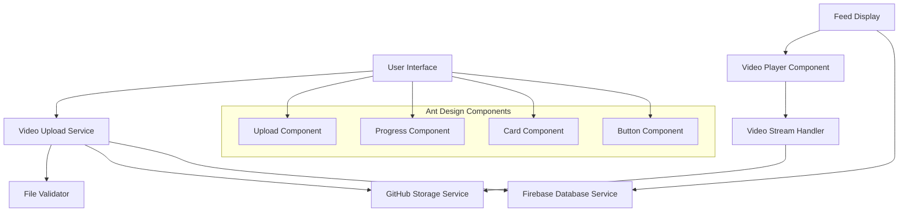

# Design Document: Video Upload Feature

## Overview

The video upload feature extends the existing image upload system to support video content while maintaining architectural consistency. The system leverages GitHub for storage and Firebase for metadata persistence, integrating seamlessly with the current Ant Design-based UI framework.

Key design principles:
- **Consistency**: Mirror the existing image upload architecture and user experience
- **Performance**: Implement progressive loading and efficient video handling
- **Scalability**: Support future video processing and optimization features
- **User Experience**: Provide intuitive upload flows with clear feedback

## Architecture

### High-Level Architecture



### Component Architecture

The video upload system follows the established component hierarchy:

1. **Enhanced Components**: Wrap Ant Design Upload component with video-specific logic
2. **Common Components**: Reusable video player and validation components
3. **Service Layer**: Video upload service extending existing file upload patterns

## Components and Interfaces

### Core Components

#### VideoUploadComponent
```typescript
interface VideoUploadProps {
  onUploadSuccess: (videoData: VideoMetadata) => void;
  onUploadError: (error: UploadError) => void;
  maxFileSize?: number; // Default: 100MB
  acceptedFormats?: string[]; // Default: ['mp4', 'mov', 'avi', 'wmv', 'mkv']
  showPreview?: boolean; // Default: true
}

interface VideoMetadata {
  id: string;
  fileName: string;
  fileSize: number;
  duration: number;
  githubUrl: string;
  uploadTimestamp: Date;
  userId: string;
  thumbnailUrl?: string;
}
```

#### VideoPlayerComponent
```typescript
interface VideoPlayerProps {
  src: string;
  poster?: string;
  autoPlay?: boolean;
  controls?: boolean;
  muted?: boolean;
  loop?: boolean;
  onLoadStart?: () => void;
  onLoadError?: (error: Error) => void;
  onPlay?: () => void;
  onPause?: () => void;
}
```

#### VideoPreviewComponent
```typescript
interface VideoPreviewProps {
  file: File;
  onConfirm: () => void;
  onCancel: () => void;
  maxDuration?: number; // seconds
}
```

### Service Interfaces

#### VideoUploadService
```typescript
interface VideoUploadService {
  uploadVideo(file: File, metadata: Partial<VideoMetadata>): Promise<VideoMetadata>;
  validateVideoFile(file: File): Promise<ValidationResult>;
  generateThumbnail(file: File): Promise<string>;
  deleteVideo(videoId: string): Promise<void>;
}

interface ValidationResult {
  isValid: boolean;
  errors: ValidationError[];
  fileInfo: {
    format: string;
    duration: number;
    resolution: { width: number; height: number };
    bitrate: number;
  };
}
```

#### GitHubStorageService (Extended)
```typescript
interface GitHubStorageService {
  // Existing image methods...
  uploadVideo(file: File, path: string): Promise<string>;
  getVideoUrl(path: string): Promise<string>;
  deleteVideo(path: string): Promise<void>;
}
```

## Data Models

### Firebase Schema Extension

The existing Firebase schema will be extended to support video content:

```typescript
// Extend existing Post interface
interface Post {
  id: string;
  userId: string;
  content: string;
  timestamp: Date;
  type: 'text' | 'image' | 'video'; // Extended
  media?: ImageMedia | VideoMedia; // Extended union type
  likes: number;
  comments: Comment[];
}

interface VideoMedia {
  type: 'video';
  url: string;
  thumbnailUrl?: string;
  fileName: string;
  fileSize: number;
  duration: number; // in seconds
  format: string;
  resolution: {
    width: number;
    height: number;
  };
  uploadPath: string; // GitHub storage path
}

// Existing ImageMedia interface remains unchanged
interface ImageMedia {
  type: 'image';
  url: string;
  fileName: string;
  fileSize: number;
  uploadPath: string;
}
```

### GitHub Storage Structure

Videos will be stored following the existing pattern:

```
/media/
  /images/          # Existing
    /user-{userId}/
      /{timestamp}-{filename}
  /videos/          # New
    /user-{userId}/
      /{timestamp}-{filename}
  /thumbnails/      # New
    /user-{userId}/
      /{videoId}-thumb.jpg
```

## Implementation Details

### File Upload Flow Integration

The video upload will be integrated into the existing PostForm workflow:

1. **Enhanced Upload Button**: Extend the existing "Thêm ảnh" button to support both images and videos
2. **File Selection**: User selects video file through the same interface as GitHubImageUpload
3. **Client-side Validation**: Validate file type, size, and basic format using existing validation patterns
4. **Preview Generation**: Create video preview similar to existing image preview
5. **User Confirmation**: Display preview with upload confirmation in the same UI pattern
6. **Upload Process**: 
   - Upload video file to GitHub storage using existing githubStorage service
   - Generate and upload thumbnail
   - Store metadata in Firebase following existing post structure
   - Update PostForm state with video URLs similar to images array

### PostForm Integration

The existing PostForm will be extended to handle videos:

```typescript
// Extend existing PostForm state
const [media, setMedia] = useState([]); // Replace images array
// Each media item: { type: 'image' | 'video', url: string, thumbnailUrl?: string }

// Extend existing post data structure
const postData = {
  title: formData.title,
  content: formData.content,
  category: formData.category,
  authorId: user.uid,
  authorName: userProfile?.displayName || user.displayName,
  authorReputation: userProfile?.reputation || 0,
  media: media, // Extended from images array
  likes: 0,
  comments: 0,
  createdAt: new Date()
};
```

### Video Player Integration

The video player will be built using HTML5 video element wrapped in Ant Design components:

```typescript
const VideoPlayer: React.FC<VideoPlayerProps> = ({ src, poster, ...props }) => {
  return (
    <Card className="video-player-card">
      <video
        src={src}
        poster={poster}
        controls
        preload="metadata"
        className="w-full rounded-lg"
        {...props}
      >
        <source src={src} type="video/mp4" />
        Your browser does not support the video tag.
      </video>
    </Card>
  );
};
```

### Performance Optimizations

1. **Lazy Loading**: Videos load only when entering viewport
2. **Progressive Enhancement**: Start with thumbnail, load video on interaction
3. **Compression**: Client-side video compression for large files
4. **Caching**: Implement service worker caching for frequently accessed videos
5. **Thumbnail Generation**: Generate thumbnails during upload for faster feed loading

### Error Handling Strategy

1. **Upload Errors**: Retry mechanism with exponential backoff
2. **Playback Errors**: Fallback to thumbnail with error message
3. **Network Errors**: Offline support with queue-based uploads
4. **Validation Errors**: Clear user feedback with suggested solutions

### Security Considerations

1. **File Type Validation**: Server-side MIME type verification
2. **Content Scanning**: Basic malware scanning before storage
3. **Access Control**: Respect existing Firebase security rules
4. **URL Security**: Use GitHub's secure URL patterns
5. **Input Sanitization**: Sanitize all user-provided metadata

## Correctness Properties

*A property is a characteristic or behavior that should hold true across all valid executions of a system—essentially, a formal statement about what the system should do. Properties serve as the bridge between human-readable specifications and machine-verifiable correctness guarantees.*

### Property 1: File Format Validation
*For any* uploaded file, the Video_Upload_System should accept the file if and only if it has both a supported extension (MP4, MOV, AVI, WMV, MKV) and matching MIME type
**Validates: Requirements 1.1, 5.1, 5.2**

### Property 2: File Size Validation  
*For any* uploaded video file, the File_Validator should reject files exceeding 100MB and accept files within the limit
**Validates: Requirements 1.2**

### Property 3: Upload Preview Display
*For any* valid video file selected for upload, the Upload_Interface should display a video preview component
**Validates: Requirements 1.3**

### Property 4: Complete Upload Flow
*For any* confirmed video upload, the system should store the file in GitHub_Storage and create corresponding metadata in Firebase_Database
**Validates: Requirements 1.4, 2.2**

### Property 5: Upload Success Feedback
*For any* completed video upload, the Video_Upload_System should display success notification to the user
**Validates: Requirements 1.5**

### Property 6: Unique Filename Generation
*For any* video upload, the Video_Upload_System should generate a unique filename that doesn't conflict with existing files
**Validates: Requirements 2.1, 5.5**

### Property 7: Data Structure Consistency
*For any* video metadata stored in Firebase, the structure should follow the same schema patterns as existing image metadata
**Validates: Requirements 2.3**

### Property 8: Upload Failure Cleanup
*For any* failed video upload, the Video_Upload_System should remove any partially uploaded data and notify the user
**Validates: Requirements 2.4**

### Property 9: Feed Video Display
*For any* video post in the feed, the Feed_Display should render a thumbnail with a play button
**Validates: Requirements 3.1**

### Property 10: Video Player Loading
*For any* video clicked by a user, the Video_Player should load with standard playback controls
**Validates: Requirements 3.2**

### Property 11: Loading State Indicators
*For any* video in loading state, the Video_Player should display appropriate loading indicators
**Validates: Requirements 3.3**

### Property 12: Playback Error Handling
*For any* video that fails to play, the Video_Player should display error messages and fallback content
**Validates: Requirements 3.4, 7.3**

### Property 13: Lazy Loading Implementation
*For any* video not currently in the viewport, the system should not load the video until it becomes visible
**Validates: Requirements 3.5, 6.2**

### Property 14: Progress Indicator Display
*For any* video upload in progress, the Upload_Interface should display real-time progress using Ant Design Progress components
**Validates: Requirements 4.3, 6.1**

### Property 15: Validation Error Messages
*For any* file that fails validation, the File_Validator should provide specific error messages indicating the exact reason for rejection
**Validates: Requirements 5.3**

### Property 16: Filename Sanitization
*For any* uploaded file, the Video_Upload_System should sanitize the filename to remove potentially dangerous characters
**Validates: Requirements 5.4**

### Property 17: Feed Virtualization
*For any* feed containing multiple videos, the Feed_Display should implement virtualization to render only visible items
**Validates: Requirements 6.3**

### Property 18: Network Error Handling
*For any* network-related failure during upload or playback, the system should provide appropriate fallback behavior and error handling
**Validates: Requirements 6.4**

### Property 19: Video Playback Controls
*For any* playing video, the Video_Player should support standard controls including pause, seek, and volume adjustment
**Validates: Requirements 6.5**

### Property 20: Error Notification System
*For any* upload failure, the Video_Upload_System should display error notifications using Ant Design notification components
**Validates: Requirements 7.1**

### Property 21: Retry Mechanism with Backoff
*For any* failed storage or network operation, the Video_Upload_System should implement retry mechanisms with exponential backoff
**Validates: Requirements 7.2, 7.4**

### Property 22: Error Logging
*For any* system error, the Video_Upload_System should log detailed error information including context and stack traces
**Validates: Requirements 7.5**

## Error Handling

### Upload Error Scenarios
1. **File Validation Errors**: Invalid format, oversized files, corrupted data
2. **Network Errors**: Connection timeouts, interrupted uploads, bandwidth limitations
3. **Storage Errors**: GitHub API failures, quota exceeded, authentication issues
4. **Database Errors**: Firebase write failures, permission denied, network partitions

### Error Recovery Strategies
1. **Automatic Retry**: Exponential backoff for transient failures
2. **User Retry**: Manual retry options for user-initiated operations
3. **Graceful Degradation**: Fallback to thumbnails when video fails to load
4. **Cleanup Operations**: Remove partial uploads on failure

### User Feedback Patterns
- **Ant Design Notifications**: For system-level errors and success messages
- **Inline Validation**: Real-time feedback during file selection
- **Progress Indicators**: Clear upload progress with cancellation options
- **Error States**: Specific error messages with suggested actions

## Testing Strategy

### Dual Testing Approach

The video upload feature requires both unit testing and property-based testing for comprehensive coverage:

**Unit Tests** focus on:
- Specific file format validation examples
- Edge cases like exactly 100MB files
- Integration points between components
- Error conditions and boundary cases
- Ant Design component integration

**Property-Based Tests** focus on:
- Universal properties across all video files
- Comprehensive input coverage through randomization
- System behavior validation across diverse scenarios
- Correctness properties defined in this document

### Property-Based Testing Configuration

- **Testing Library**: Use `fast-check` for JavaScript/TypeScript property-based testing
- **Test Iterations**: Minimum 100 iterations per property test
- **Test Tagging**: Each property test must reference its design document property
- **Tag Format**: `// Feature: video-upload-feature, Property {number}: {property_text}`

### Test Implementation Requirements

Each correctness property must be implemented by a single property-based test that:
1. Generates appropriate random inputs for the property domain
2. Executes the system behavior being tested
3. Validates the expected property holds true
4. References the specific design document property
5. Maps back to the original requirements

### Example Property Test Structure

```typescript
// Feature: video-upload-feature, Property 1: File Format Validation
test('video format validation property', () => {
  fc.assert(fc.property(
    fc.record({
      extension: fc.oneof(...supportedExtensions, ...unsupportedExtensions),
      mimeType: fc.oneof(...validMimeTypes, ...invalidMimeTypes)
    }),
    (fileData) => {
      const isValidExtension = supportedExtensions.includes(fileData.extension);
      const isValidMimeType = validMimeTypes.includes(fileData.mimeType);
      const shouldAccept = isValidExtension && isValidMimeType;
      
      const result = validateVideoFile(createMockFile(fileData));
      expect(result.isValid).toBe(shouldAccept);
    }
  ));
});
```

This comprehensive testing strategy ensures both specific examples work correctly (unit tests) and universal properties hold across all inputs (property tests), providing robust validation of the video upload system's correctness.